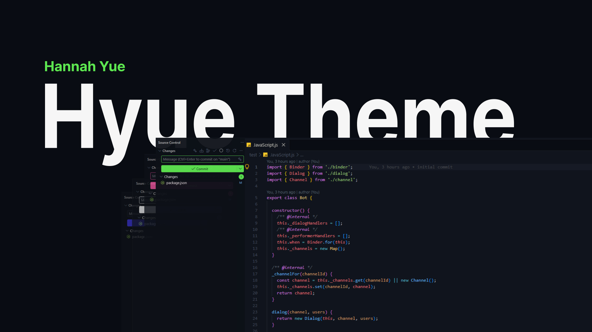

# Hyue Theme

> Made By @HannahYue

A clean, focused dark theme for Visual Studio Code, designed for comfortable everyday development.



## Features

* Carefully balanced dark interface
* Clear syntax highlighting
* Comfortable contrast for long coding sessions
* Consistent colors across the VS Code workbench
* Support for modern JavaScript and TypeScript workflows
* Designed for readability without excessive color

## Installation

### VS Code Marketplace

Search for **Hyue Theme** in the VS Code Extensions view and select **Install**.

### VSIX

Download the latest `.vsix` release and install it through:

**Extensions →** `...` **→ Install from VSIX...**

Or use the command line:

```
code --install-extension hannah-yue-theme.vsix
```

## Activate

After installation:

1. Open the Command Palette.
2. Run `Preferences: Color Theme`.
3. Select **Hannah Yue Theme**.

## Development

Clone the repository:

```
git clone https://github.com/official-hannahyue/hannah-yue-theme.git
cd hannah-yue-theme
```

Open the project in Visual Studio Code:

```
code .
```

Make changes to the theme files and preview them in VS Code.

## Project Structure

```
.
├── themes/
│   └── hannah-yue-color-theme.json
├── CHANGELOG.md
├── LICENSE
├── package.json
└── README.md
```

## License

This project is licensed under the [MIT License](https://chatgpt.com/g/g-p-6ac4e662b4fc81919ac7aa1f64279b60-vscode-theme/c/LICENSE).

## Author

**Hannah Yue**

GitHub: `@official-hannahyue`
